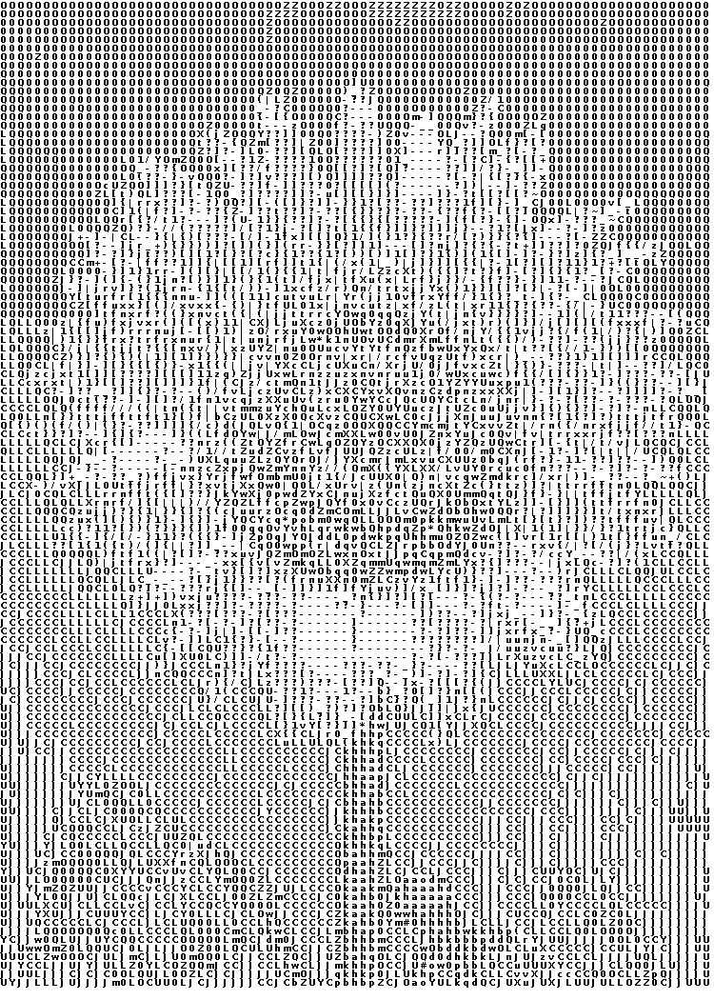
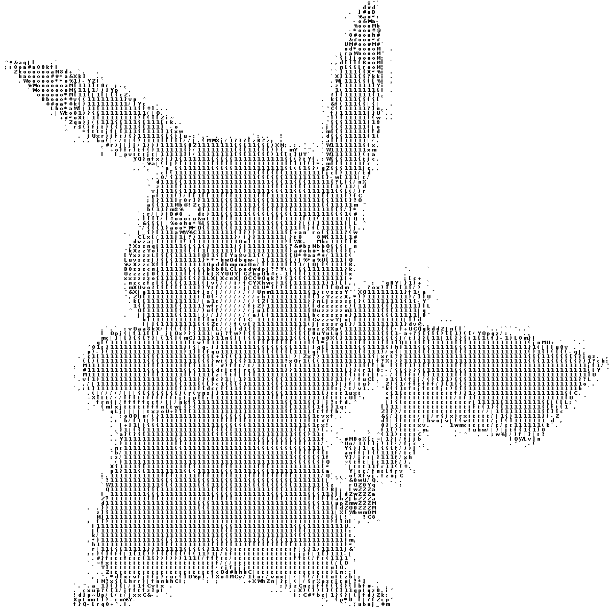

# asciify

Algorithm for ascifying images. Usage:
```
Asciify
Usage: <main class> -f=<file> [-i=<interpolation>] [-w=<windowSize>]
Used to asciify images
  -f, --file=<file>   Target image file for asciifying
  -i, --interpolation=<interpolation>
                      How much should the image be interpolated
  -w, --window=<windowSize>
                      How big should the window's size be
```

<table border="1" width="100%">
    <tr>
        <td></td>
        <td></td>
    </tr>
    <tr>
        <td></td>
        <td></td>
    </tr>
    <tr>
        <td></td>
        <td></td>
    </tr>
</table>

