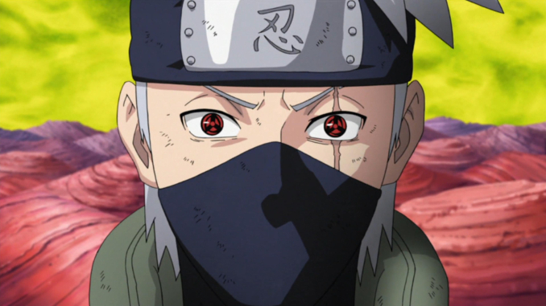
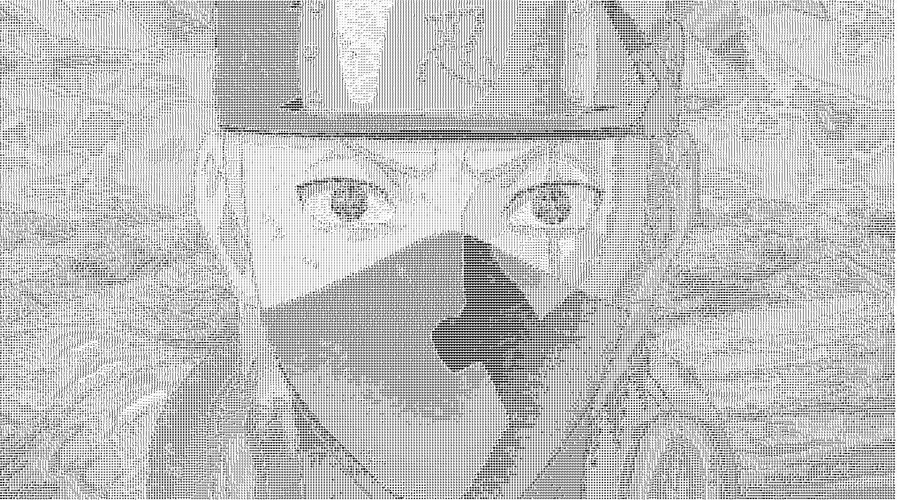
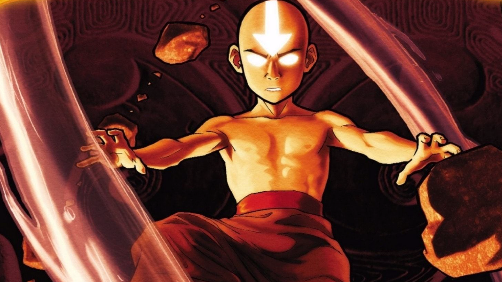
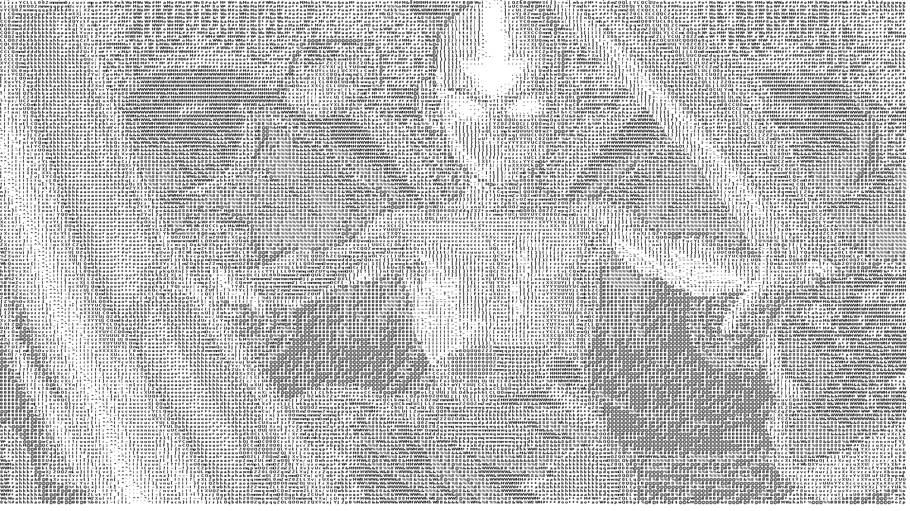
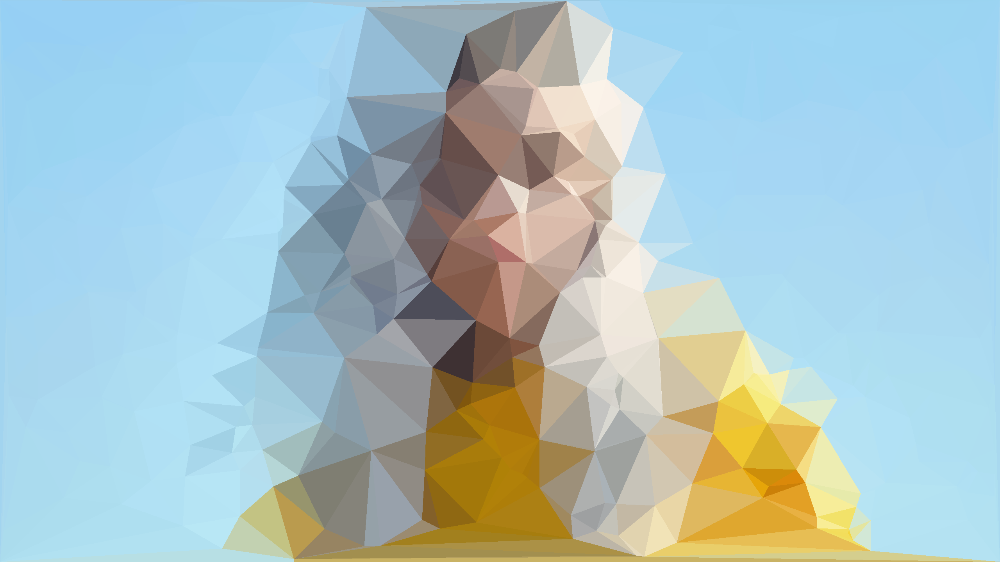

# Pixel Arts

Algorithm for playing around with images. Assuming an image is just a matrix, you can do everything with an image which can
also be done on a matrix.

```
Usage: java -jar arts.jar [COMMAND]
Commands:
  asciify        Used to asciify images
  voronoi        Used to triangulate images
```

### ACIIFY

<table border="1" width="100%">
    <tr>
        <td></td>
        <td></td>
    </tr>
    <tr>
        <td></td>
        <td></td>
    </tr>
    <tr>
        <td></td>
        <td></td>
    </tr>
</table>

### Triangulation

<table border="1" width="100%">
    <tr>
        <td></td>
        <td></td>
    </tr>
</table>